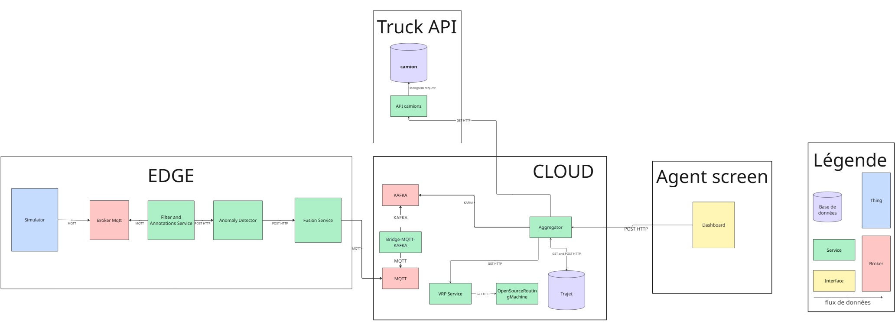

# Projet_trajet_optimise_IoTCPS_Grp5


# Projet d'optimisation de trajet de collecte de dechet

## Contexte

Projet réalisé dans le cadre du cours de systèmes intelligents autonomes (2025 - 2026) 

Ce développement est un Proof Of Concept d'un projet conceptualisé pendant les cours de _Fondements  et défis des systèmes Cyber-Physiques_([Rapport](doc/Rapport%20Fondements%20et%20défis%20des%20systèmes%20Cyber-Physiques.pdf)) et de _L'iot aux systèmes Cyber-Physiques_ ([Rapport](doc/Rapport%20De%20l'IoT%20aux%20systèmes%20Cyber-Physiques.pdf)). Le projet porte sur le développement d'un système de génération de trajet optimisé pour la collecte des déchets par les éboueurs, c'est-à-dire en ne passant que par les poubelles pleine. La détection se remplissage de poubelle sera fera grâce à des capteurs ultrasons situés sous le couvercle vers le bas permettant de mesurer la distance entre le sommet des déchets et le haut du couvercle. En plus, de cela nous avons des capteurs infrarouges situé à plusieurs paliers de hauteurs de la poubelle (25%, 50%, 75%) permettant de faire de la validation croisée avec l'ultrason. Enfin, nous avons des capteurs de poids afin de générer un trajet que les charges des camions puissent supporter.


---

## Architecture



### Services Edge

| Service            | Technologie             | Description                                                                                                                                                                                                                    |
|--------------------|-------------------------|--------------------------------------------------------------------------------------------------------------------------------------------------------------------------------------------------------------------------------|
| **Simulator**      | Python, MQTT    | Simule les données capteurs des poubelles(avec bruitage/erreurs), il envoie 10 mesures au même moment pour chaque capteurs afin d'aider le filtre à se débarrasser des bruits plus facilement.                                 |
| **Filter and Annoations Service**  | Python, http            | Filtre les données en éliminant les valeurs aberrantes et fais une moyenne des mesures afin d'obtenir une valeur fiable + Annotation des données capteurs avec la configuration de la poubelle dans les données (adresse, dimensions, type de déchets...). |
| **AnomaliesDetector**| Python, http            | Vérifie la cohérence des données entre elles (capteurs ultrasons indiquant une poubelle presque rempli mais l'infrarouge situé à 75% de la poubelle indique qu'il n'y a pas d'obstacles en face de lui).                       |
| **Fusion Service**  | Python, MQTT           | Calcule l'état (E1-E5) des poubelles à partir des capteurs bruts en utilisant la méthode de Dempster-Shafer et en prenant en compte le type de poubelle car les capteurs sont moins fiables au niveau de leurs mesures face à certains déchets.                                                                                                                  |

### Services Cloud
| Service            | Technologie             | Description                                                                                                                                                                         |
|--------------------|-------------------------|-------------------------------------------------------------------------------------------------------------------------------------------------------------------------------------|
| **Bridge-MQTT-KAFKA**         | Python, http          | Permet de recevoir les données envoyées par chaque poubelle  et le transmettre au dataLake qui est Kafka dans notre cas                                                             |
| **Aggregator**     | Python, Flask           | Centralisation de l'état des poubelles et déclenchement des collectes.Les tournées sont générées de manière distinctes selon le type de déchet (Verre, Recyclable, Organique, etc.) |
| **VRP Service**    | OR-Tools, FastAPI       | Résout le problème de tournée de véhicules via le backend **OSRM** et la librairie **Google OR-Tools**. Fallbacks mathématiques si OSRM indisponible(Haversine)                                                                            |
| **OpenSourceRoutingMachine Backend**   | C++                     | Moteur de routage géographique local.                                                                                                                                               |
| **Infrastructure** | Kafka, Zookeeper, Mongo | Bus de messages et persistance des données des trajets.                                                                                                                                         |

### Truck API
| Service            | Technologie             | Description                                     |
|--------------------|-------------------------|-------------------------------------------------|
| **Truck service**  | Python, http            | Expose les informations des camions disponibles |
| **Infrastructure** | Mongo | Persistance des données des camions.                        |

### Agent-screen
| Service            | Technologie             | Description                                                                                                   |
|--------------------|-------------------------|---------------------------------------------------------------------------------------------------------------|
| **Dashboard**      | Streamlit, Folium       | Interface utilisateur avec **Streamlit** pour génerer les trajets de collecte et les visualiser sur une carte |

---

## Installation

### Prérequis

* [Docker](https://www.docker.com/get-started/) & [Docker Compose](https://docs.docker.com/compose/install/)
* Un environnement windows est conseillé.

### 1. Clonage du dépôt

```bash
git clone https://github.com/NoeFBou/Projet_trajet_optimise_IoTCPS_Grp5.git
cd Projet_trajet_optimise_IoTCPS_Grp5

```

### 2. Exécution du projet
```bash
cd Cloud
docker-compose up -d
```
*La première exécution peut prendre quelques minutes pour construire les images et initialiser Kafka.*
Il faut attendre que le cloud finisse de se lancer.
```bash
cd ../TruckAPI
docker-compose up -d
cd ../Agent-screen
docker-compose up -d 
```
Et enfin on lance le Edge pour démarrer la simulation.
```bash
cd ../Edge
docker-compose up -d
```


---

## ️ Utilisation

Une fois tous les conteneurs lancés, les interfaces suivantes sont accessibles :

### Dashboard

* **URL :** `http://localhost:8501`
* **Fonctions :**
  * Visualiser les poubelles pleines sur la carte.
  * Générer des trajets optimisés pour la collecte en cliquant sur un bouton.
  * Filtrer les trajets par type de camion (Verre, Organique...).
  * Consulter l'historique des collectes.


### Kafka
Vous pouvez consulter le contenu des topics kafka via : 
* **URL :** `http://localhost:8080`


## Licence

Ce projet est sous licence MIT - voir le fichier [LICENSE](LICENSE) pour plus de détails.

---
